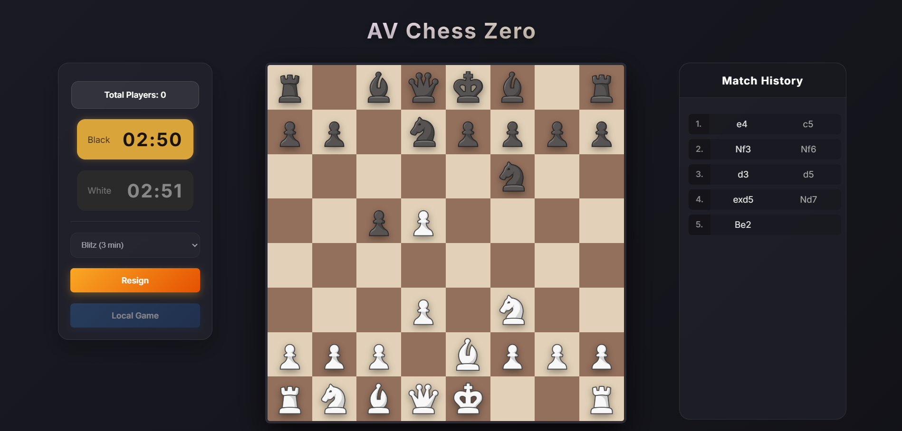

# AV Chess Zero

A fully functional chess application built from scratch using JavaScript, with complete rule enforcement, real-time online multiplayer, timed matches, and a clean, interactive user interface.



## Features

### Core Chess Engine
All core game mechanics have been implemented manually, including:

- Legal move validation for all pieces
- Castling
- Pawn promotion
- Check and checkmate detection
- Restriction of illegal moves when the king is in check
- Move history tracking

### Chess Clock
Every match is played on a real chess clock with selectable time controls:

- **Bullet** — 1 minute
- **Blitz** — 3 minutes
- **Rapid** — 10 minutes
- **Classic** — 30 minutes

The active player's clock counts down, switches on each move, highlights when time
is low, and ends the game automatically on a flag (timeout).

### Online Multiplayer (Socket.IO)
Real-time play against another person over a Socket.IO connection:

- **Matchmaking** — players are queued by time control and paired automatically
- **Live move relay** — moves are streamed to the opponent in real time
- **Resign & disconnect handling** — the game ends cleanly when a player resigns or leaves
- **Live player count** — shows how many players are currently connected
- A "Searching for opponents" overlay while waiting for a match, plus a game-over popup

A **Local Game** mode is also available to play both sides on a single device.

## Project Structure

```
Chess/
├── index.html            # Main page and UI layout
├── styles/               # Stylesheet(s)
├── Javascript/
│   ├── index.js          # App entry point + socket client wiring
│   ├── Data/             # Board/piece state and setup
│   ├── Events/           # Game event handling and move logic
│   ├── Helper/           # Chess clock, overlays, and helpers (addCloak.js)
│   └── Render/           # Board and piece rendering
└── Server/
    ├── socket.js         # Socket.IO matchmaking & game server
    └── package.json
```

## Getting Started

### 1. Start the server
```bash
cd Server
npm install
npm start
```
The socket server listens on port **3000**.

### 2. Run the client
Serve the project root with a static server (e.g. VS Code Live Server) at
`http://127.0.0.1:5500` — the server's CORS config expects this origin. Then open
`index.html` in the browser.

To play online, open the page in two browser tabs/devices, pick the same time
control, and click **Play Online** in each.

## Tech Stack
- Vanilla JavaScript (ES modules), HTML, CSS
- [Socket.IO](https://socket.io/) for real-time multiplayer (client + Node.js server)

## Notes
The project focuses on accurately modeling chess logic while providing a smooth and
intuitive user experience. It demonstrates strong problem-solving, state management,
DOM manipulation, and real-time networking skills.

## Future Enhancements
Missing chess rules: Add support for en passant, threefold repetition, 50‑move rule, insufficient material draws, and stricter castling‑through‑check enforcement.

Reconnection & persistence: Introduce a database layer (Postgres/Redis) so games survive server restarts and players can reconnect after drops.

User accounts & ratings: Implement persistent profiles with Elo/Glicko ratings and match history tracking.

AI opponent: Build a minimax + alpha‑beta engine using the existing move generators for offline/solo play.

Responsive board & animations: Improve UI with fluid aspect‑ratio sizing and smooth move animations across devices.
